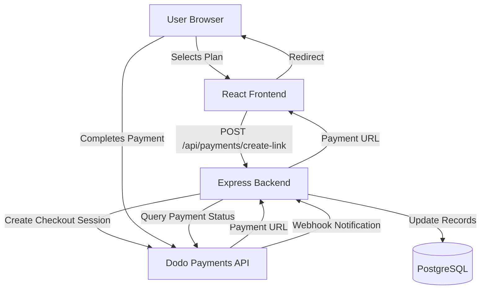
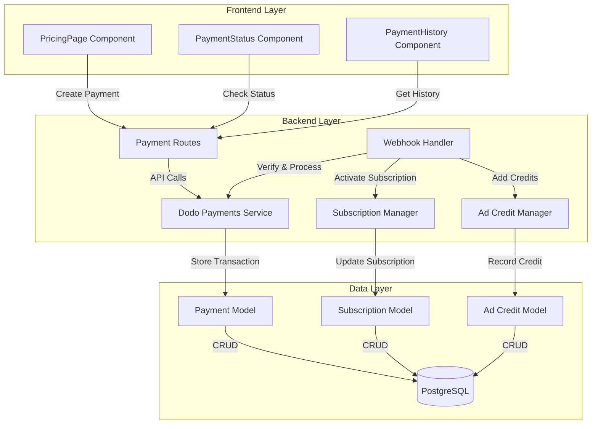
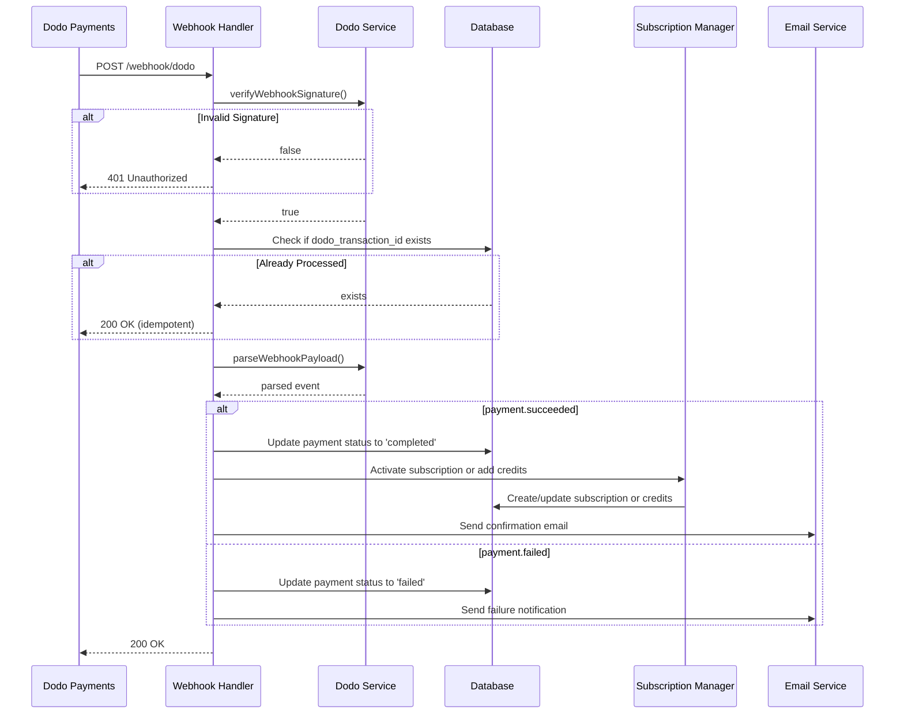

# Design Document: Dodo Payments Integration

## Overview

This design document outlines the technical architecture for integrating Dodo Payments as a payment provider into the Odelink platform. The integration enables users to purchase subscription plans (Standard and Professional) and advertisement packages through secure payment links, with automated webhook processing for subscription activation and credit management.

### Goals

- Integrate Dodo Payments API for payment link creation
- Implement secure webhook handling with signature verification
- Automate subscription activation upon successful payment
- Manage advertisement credits through payment processing
- Maintain payment transaction history for users and admins
- Ensure security through CSRF protection, rate limiting, and webhook validation

### Non-Goals

- Removing existing Stripe integration (will be kept but inactive)
- Implementing recurring billing automation (handled by Dodo Payments)
- Building custom payment UI (using Dodo Payments hosted checkout)
- Supporting payment methods other than those provided by Dodo Payments

### Key Design Decisions

1. **Service Layer Architecture**: Create a dedicated `dodoPaymentsService.js` to encapsulate all Dodo Payments API interactions, following the existing pattern used by `shopierApiService.js` and `cloudflareService.js`.

2. **Webhook Security**: Implement signature verification using the Standard Webhooks specification with HMAC SHA256, following Dodo Payments' recommended approach.

3. **Database Schema**: Introduce two new tables (`payments` and `advertisement_credits`) while maintaining compatibility with existing `subscriptions` and `user_subscriptions` tables.

4. **Idempotency**: Use `dodo_transaction_id` as a unique constraint to prevent duplicate webhook processing.

5. **Test Mode Support**: Environment-based configuration to enable safe testing without affecting production data.

## Architecture

### System Context



### Component Architecture



## Components and Interfaces

### Backend Components

#### 1. Dodo Payments Service (`backend/services/dodoPaymentsService.js`)

**Purpose**: Encapsulate all Dodo Payments API interactions.

**Key Methods**:

```javascript
class DodoPaymentsService {
  /**
   * Initialize service with API credentials
   * @param {string} apiKey - Dodo Payments API key
   * @param {string} webhookSecret - Webhook signature secret
   * @param {boolean} testMode - Enable test mode
   */
  constructor(apiKey, webhookSecret, testMode = false)

  /**
   * Create a checkout session for payment
   * @param {Object} params - Payment parameters
   * @param {string} params.productId - Product ID from Dodo Payments
   * @param {number} params.amount - Amount in TRY
   * @param {string} params.productType - 'subscription' or 'ad_package'
   * @param {Object} params.customer - Customer details
   * @param {Object} params.metadata - Additional metadata
   * @returns {Promise<{checkoutUrl: string, sessionId: string}>}
   */
  async createCheckoutSession(params)

  /**
   * Verify webhook signature
   * @param {string} rawBody - Raw request body
   * @param {Object} headers - Webhook headers
   * @returns {boolean} - True if signature is valid
   */
  verifyWebhookSignature(rawBody, headers)

  /**
   * Query payment status from Dodo Payments
   * @param {string} paymentId - Dodo payment ID
   * @returns {Promise<Object>} - Payment status details
   */
  async getPaymentStatus(paymentId)

  /**
   * Parse webhook payload
   * @param {string} rawBody - Raw request body
   * @returns {Object} - Parsed webhook event
   */
  parseWebhookPayload(rawBody)
}
```

**Dependencies**:
- `crypto` (Node.js built-in for HMAC)
- `axios` or `node-fetch` for HTTP requests
- Environment variables: `DODO_PAYMENTS_API_KEY`, `DODO_WEBHOOK_SECRET`, `TEST_MODE`

#### 2. Payment Routes (`backend/routes/payments.js`)

**Endpoints**:

```javascript
// Create payment link
POST /api/payments/create-link
Body: {
  productType: 'subscription' | 'ad_package',
  productId: string,  // 'standard_monthly', 'professional_yearly', 'ad_basic', etc.
  tier: string,       // For subscriptions: 'standart' or 'profesyonel'
  billingCycle: string // For subscriptions: 'monthly' or 'yearly'
}
Response: {
  success: boolean,
  paymentUrl: string,
  transactionId: string
}

// Get payment status
GET /api/payments/status/:transactionId
Response: {
  status: 'pending' | 'completed' | 'failed',
  amount: number,
  productType: string,
  paymentDate: string | null
}

// Get payment history (user)
GET /api/payments/history?page=1&limit=20
Response: {
  payments: Array<Payment>,
  total: number,
  page: number,
  totalPages: number
}

// Admin: Get all payments
GET /api/payments/admin/all?userId=&status=&productType=&startDate=&endDate=
Response: {
  payments: Array<Payment>,
  total: number
}

// Admin: Manually complete payment
POST /api/payments/admin/complete/:transactionId
Response: {
  success: boolean,
  message: string
}
```

**Middleware**:
- `authMiddleware` - Verify JWT token
- `adminOnly` - Restrict admin endpoints
- `rateLimiters.paymentLimiter` - Rate limit payment creation (10 requests/minute)

#### 3. Webhook Handler (`backend/routes/payments.js` - webhook endpoint)

**Endpoint**:

```javascript
POST /api/payments/webhook/dodo
Headers: {
  'webhook-id': string,
  'webhook-signature': string,
  'webhook-timestamp': string
}
Body: {
  business_id: string,
  type: 'payment.succeeded' | 'payment.failed' | 'subscription.active' | ...,
  timestamp: string,
  data: {
    payload_type: 'Payment' | 'Subscription',
    // ... event-specific fields
  }
}
```

**Processing Flow**:



#### 4. Payment Model (`backend/models/Payment.js`)

**Schema**:

```javascript
{
  id: UUID (primary key),
  user_id: UUID (foreign key -> users.id),
  transaction_id: VARCHAR(255) UNIQUE,
  dodo_transaction_id: VARCHAR(255) UNIQUE,
  amount: DECIMAL(10,2),
  currency: VARCHAR(3) DEFAULT 'TRY',
  product_type: VARCHAR(50), // 'subscription' or 'ad_package'
  product_id: VARCHAR(100),   // 'standard_monthly', 'ad_basic', etc.
  tier: VARCHAR(50),          // For subscriptions: 'standart', 'profesyonel'
  billing_cycle: VARCHAR(20), // For subscriptions: 'monthly', 'yearly'
  status: VARCHAR(20),        // 'pending', 'completed', 'failed'
  payment_method: VARCHAR(50),
  payment_date: TIMESTAMP,
  failure_reason: TEXT,
  metadata: JSONB,
  created_at: TIMESTAMP,
  updated_at: TIMESTAMP
}
```

**Indexes**:
- `idx_payments_user_id` on `user_id`
- `idx_payments_status` on `status`
- `idx_payments_created_at` on `created_at`
- `idx_payments_dodo_transaction_id` on `dodo_transaction_id` (unique)

**Key Methods**:

```javascript
class Payment {
  static async create(paymentData)
  static async findByTransactionId(transactionId)
  static async findByDodoTransactionId(dodoTransactionId)
  static async updateStatus(transactionId, status, updateData)
  static async getUserPayments(userId, { page, limit })
  static async getAllPayments(filters)
  static async ensureSchema()
}
```

#### 5. Advertisement Credit Model (`backend/models/AdvertisementCredit.js`)

**Schema**:

```javascript
{
  id: UUID (primary key),
  user_id: UUID (foreign key -> users.id),
  amount: DECIMAL(10,2),
  source: VARCHAR(50),        // 'purchase', 'refund', 'admin_adjustment'
  source_transaction_id: UUID (foreign key -> payments.id),
  balance_after: DECIMAL(10,2),
  description: TEXT,
  created_at: TIMESTAMP
}
```

**Indexes**:
- `idx_ad_credits_user_id` on `user_id`
- `idx_ad_credits_created_at` on `created_at`

**Key Methods**:

```javascript
class AdvertisementCredit {
  static async addCredit(userId, amount, source, sourceTransactionId, description)
  static async getUserBalance(userId)
  static async getUserCreditHistory(userId, { page, limit })
  static async ensureSchema()
}
```

### Frontend Components

#### 1. PricingPage Component (`frontend/src/components/PricingPage.js`)

**Purpose**: Display subscription plans and advertisement packages with payment initiation.

**Props**: None (fetches data from API)

**State**:
```javascript
{
  plans: Array<Plan>,
  adPackages: Array<AdPackage>,
  loading: boolean,
  error: string | null,
  processingPayment: boolean
}
```

**Key Methods**:
```javascript
async handlePurchasePlan(tier, billingCycle)
async handlePurchaseAdPackage(packageId)
```

**API Calls**:
- `GET /api/subscriptions/plans` - Fetch available plans
- `POST /api/payments/create-link` - Initiate payment

#### 2. PaymentStatus Component (`frontend/src/components/PaymentStatus.js`)

**Purpose**: Display payment status after redirect from Dodo Payments.

**Props**:
```javascript
{
  transactionId: string (from URL query parameter)
}
```

**State**:
```javascript
{
  status: 'pending' | 'completed' | 'failed' | 'loading',
  paymentDetails: Object | null,
  error: string | null
}
```

**API Calls**:
- `GET /api/payments/status/:transactionId` - Poll payment status

#### 3. PaymentHistory Component (`frontend/src/components/PaymentHistory.js`)

**Purpose**: Display user's payment transaction history.

**State**:
```javascript
{
  payments: Array<Payment>,
  loading: boolean,
  error: string | null,
  page: number,
  totalPages: number
}
```

**API Calls**:
- `GET /api/payments/history?page=1&limit=20` - Fetch payment history

## Data Models

### Database Schema

```sql
-- Payments table
CREATE TABLE payments (
  id UUID PRIMARY KEY DEFAULT uuid_generate_v4(),
  user_id UUID NOT NULL REFERENCES users(id) ON DELETE CASCADE,
  transaction_id VARCHAR(255) UNIQUE NOT NULL,
  dodo_transaction_id VARCHAR(255) UNIQUE,
  amount DECIMAL(10,2) NOT NULL,
  currency VARCHAR(3) DEFAULT 'TRY',
  product_type VARCHAR(50) NOT NULL,
  product_id VARCHAR(100) NOT NULL,
  tier VARCHAR(50),
  billing_cycle VARCHAR(20),
  status VARCHAR(20) DEFAULT 'pending',
  payment_method VARCHAR(50),
  payment_date TIMESTAMP,
  failure_reason TEXT,
  metadata JSONB,
  created_at TIMESTAMP DEFAULT CURRENT_TIMESTAMP,
  updated_at TIMESTAMP DEFAULT CURRENT_TIMESTAMP
);

CREATE INDEX idx_payments_user_id ON payments(user_id);
CREATE INDEX idx_payments_status ON payments(status);
CREATE INDEX idx_payments_created_at ON payments(created_at);
CREATE INDEX idx_payments_dodo_transaction_id ON payments(dodo_transaction_id);

-- Advertisement credits table
CREATE TABLE advertisement_credits (
  id UUID PRIMARY KEY DEFAULT uuid_generate_v4(),
  user_id UUID NOT NULL REFERENCES users(id) ON DELETE CASCADE,
  amount DECIMAL(10,2) NOT NULL,
  source VARCHAR(50) NOT NULL,
  source_transaction_id UUID REFERENCES payments(id),
  balance_after DECIMAL(10,2) NOT NULL,
  description TEXT,
  created_at TIMESTAMP DEFAULT CURRENT_TIMESTAMP
);

CREATE INDEX idx_ad_credits_user_id ON advertisement_credits(user_id);
CREATE INDEX idx_ad_credits_created_at ON advertisement_credits(created_at);

-- Add trigger for updated_at
CREATE OR REPLACE FUNCTION update_updated_at_column()
RETURNS TRIGGER AS $$
BEGIN
  NEW.updated_at = CURRENT_TIMESTAMP;
  RETURN NEW;
END;
$$ language 'plpgsql';

CREATE TRIGGER update_payments_updated_at BEFORE UPDATE ON payments
FOR EACH ROW EXECUTE FUNCTION update_updated_at_column();
```

### Product Mapping

**Subscription Plans**:
```javascript
const SUBSCRIPTION_PRODUCTS = {
  standard_monthly: {
    tier: 'standart',
    billingCycle: 'monthly',
    amount: 299,
    dodoProductId: process.env.DODO_PRODUCT_STANDARD_MONTHLY
  },
  professional_yearly: {
    tier: 'profesyonel',
    billingCycle: 'yearly',
    amount: 399,
    dodoProductId: process.env.DODO_PRODUCT_PROFESSIONAL_YEARLY
  }
};
```

**Advertisement Packages**:
```javascript
const AD_PACKAGES = {
  ad_basic: {
    name: 'Başlangıç',
    amount: 500,
    creditAmount: 500,
    dodoProductId: process.env.DODO_PRODUCT_AD_BASIC
  },
  ad_professional: {
    name: 'Profesyonel',
    amount: 1200,
    creditAmount: 1200,
    dodoProductId: process.env.DODO_PRODUCT_AD_PROFESSIONAL
  },
  ad_premium: {
    name: 'Premium',
    amount: 2500,
    creditAmount: 2500,
    dodoProductId: process.env.DODO_PRODUCT_AD_PREMIUM
  }
};
```

## Error Handling

### Error Categories

1. **API Errors** (`api_error`):
   - Dodo Payments API request failures
   - Network timeouts
   - Invalid API responses

2. **Validation Errors** (`validation_error`):
   - Invalid payment parameters
   - Missing required fields
   - Invalid webhook payload schema

3. **Database Errors** (`database_error`):
   - Transaction creation failures
   - Query execution errors
   - Constraint violations

4. **Webhook Errors** (`webhook_error`):
   - Invalid webhook signature
   - Duplicate transaction processing
   - Webhook processing failures

### Error Handling Strategy

```javascript
// Centralized error handler
class PaymentError extends Error {
  constructor(message, category, statusCode = 500, details = {}) {
    super(message);
    this.category = category;
    this.statusCode = statusCode;
    this.details = details;
    this.timestamp = new Date().toISOString();
  }
}

// Usage in routes
try {
  const result = await dodoPaymentsService.createCheckoutSession(params);
  res.json({ success: true, ...result });
} catch (error) {
  if (error instanceof PaymentError) {
    logger.error('Payment error', {
      category: error.category,
      message: error.message,
      details: error.details,
      userId: req.userId
    });
    return res.status(error.statusCode).json({
      error: error.message,
      category: error.category
    });
  }
  // Unexpected errors
  logger.error('Unexpected payment error', { error, userId: req.userId });
  res.status(500).json({ error: 'Bir hata oluştu' });
}
```

### Retry Logic

```javascript
// Exponential backoff for API requests
async function retryWithBackoff(fn, maxRetries = 3) {
  for (let attempt = 1; attempt <= maxRetries; attempt++) {
    try {
      return await fn();
    } catch (error) {
      if (attempt === maxRetries) throw error;
      const delay = Math.pow(2, attempt) * 1000; // 2s, 4s, 8s
      await new Promise(resolve => setTimeout(resolve, delay));
    }
  }
}
```

### User-Facing Error Messages

```javascript
const ERROR_MESSAGES = {
  PAYMENT_LINK_CREATION_FAILED: 'Ödeme bağlantısı oluşturulamadı. Lütfen tekrar deneyin.',
  PAYMENT_NOT_FOUND: 'Ödeme kaydı bulunamadı.',
  INVALID_PRODUCT: 'Geçersiz ürün seçimi.',
  WEBHOOK_VERIFICATION_FAILED: 'Webhook doğrulaması başarısız.',
  DATABASE_ERROR: 'Veritabanı hatası oluştu.',
  PAYMENT_ALREADY_PROCESSED: 'Bu ödeme zaten işlenmiş.',
  INSUFFICIENT_PERMISSIONS: 'Bu işlem için yetkiniz yok.'
};
```

## Testing Strategy

### Unit Tests

**Backend Services**:
- `dodoPaymentsService.test.js`:
  - Test API request formatting
  - Test webhook signature verification with known signatures
  - Test error handling for API failures
  - Test retry logic with mocked failures

- `Payment.model.test.js`:
  - Test CRUD operations
  - Test unique constraint on `dodo_transaction_id`
  - Test query filters and pagination

- `AdvertisementCredit.model.test.js`:
  - Test credit addition and balance calculation
  - Test credit history retrieval

**Backend Routes**:
- `payments.routes.test.js`:
  - Test payment link creation with valid/invalid data
  - Test authentication and authorization
  - Test rate limiting
  - Test webhook endpoint with valid/invalid signatures
  - Test idempotency with duplicate webhook events

**Frontend Components**:
- `PricingPage.test.js`:
  - Test plan rendering
  - Test payment initiation
  - Test error handling

- `PaymentStatus.test.js`:
  - Test status polling
  - Test different payment states (pending, completed, failed)

- `PaymentHistory.test.js`:
  - Test payment list rendering
  - Test pagination

### Integration Tests

1. **End-to-End Payment Flow**:
   - Create payment link
   - Simulate webhook callback
   - Verify subscription activation
   - Verify payment record creation

2. **Webhook Processing**:
   - Test successful payment webhook
   - Test failed payment webhook
   - Test duplicate webhook handling (idempotency)
   - Test invalid signature rejection

3. **Admin Operations**:
   - Test manual payment completion
   - Test payment filtering and search

### Test Data

```javascript
// Mock Dodo Payments responses
const mockCheckoutSessionResponse = {
  checkout_url: 'https://checkout.dodopayments.com/session_123',
  session_id: 'session_123'
};

const mockSuccessfulWebhook = {
  business_id: 'business_123',
  type: 'payment.succeeded',
  timestamp: '2024-01-15T10:30:00Z',
  data: {
    payload_type: 'Payment',
    payment_id: 'pay_123',
    amount: 299,
    currency: 'TRY',
    status: 'succeeded',
    metadata: {
      user_id: 'user_123',
      product_type: 'subscription',
      tier: 'standart',
      billing_cycle: 'monthly'
    }
  }
};
```

### Test Mode Configuration

```javascript
// Environment variables for testing
TEST_MODE=true
DODO_PAYMENTS_API_KEY=test_key_123
DODO_WEBHOOK_SECRET=test_webhook_secret_123
DODO_API_ENDPOINT=https://api.dodopayments.com/test
```

**Test Mode Behaviors**:
- All `transaction_id` values prefixed with `TEST_`
- No real emails sent (logged instead)
- Uses Dodo Payments test API endpoint
- All logs prefixed with `[TEST MODE]`

## Security Measures

### 1. Webhook Signature Verification

Implementation following Standard Webhooks specification:

```javascript
function verifyWebhookSignature(rawBody, headers) {
  const webhookId = headers['webhook-id'];
  const webhookTimestamp = headers['webhook-timestamp'];
  const webhookSignature = headers['webhook-signature'];
  
  if (!webhookId || !webhookTimestamp || !webhookSignature) {
    return false;
  }
  
  // Build signed message: webhook-id.webhook-timestamp.payload
  const signedMessage = `${webhookId}.${webhookTimestamp}.${rawBody}`;
  
  // Compute HMAC SHA256
  const expectedSignature = crypto
    .createHmac('sha256', process.env.DODO_WEBHOOK_SECRET)
    .update(signedMessage)
    .digest('base64');
  
  // Constant-time comparison to prevent timing attacks
  return crypto.timingSafeEqual(
    Buffer.from(webhookSignature),
    Buffer.from(expectedSignature)
  );
}
```

### 2. CSRF Protection

```javascript
// Generate CSRF token when initiating payment
const csrfToken = crypto.randomBytes(32).toString('hex');
req.session.csrfToken = csrfToken;
req.session.csrfExpiry = Date.now() + 15 * 60 * 1000; // 15 minutes

// Include in callback URL
const callbackUrl = `${process.env.FRONTEND_URL}/payment/callback?token=${csrfToken}&transactionId=${transactionId}`;

// Validate on callback
if (!req.session.csrfToken || req.session.csrfToken !== req.query.token) {
  return res.status(403).json({ error: 'Invalid CSRF token' });
}
if (Date.now() > req.session.csrfExpiry) {
  return res.status(403).json({ error: 'CSRF token expired' });
}
```

### 3. Rate Limiting

```javascript
// In middleware/rateLimiters.js
const paymentLimiter = rateLimit({
  windowMs: 60 * 1000, // 1 minute
  max: 10, // 10 requests per minute
  message: 'Çok fazla ödeme isteği. Lütfen bir dakika sonra tekrar deneyin.',
  standardHeaders: true,
  legacyHeaders: false
});

const webhookLimiter = rateLimit({
  windowMs: 60 * 1000, // 1 minute
  max: 100, // 100 requests per minute per IP
  message: 'Webhook rate limit exceeded',
  standardHeaders: true,
  legacyHeaders: false
});
```

### 4. Input Validation

```javascript
// Using express-validator
const { body, validationResult } = require('express-validator');

const createPaymentLinkValidation = [
  body('productType').isIn(['subscription', 'ad_package']),
  body('productId').isString().notEmpty(),
  body('tier').optional().isIn(['standart', 'profesyonel']),
  body('billingCycle').optional().isIn(['monthly', 'yearly'])
];

router.post('/create-link', 
  authMiddleware,
  paymentLimiter,
  createPaymentLinkValidation,
  async (req, res) => {
    const errors = validationResult(req);
    if (!errors.isEmpty()) {
      return res.status(400).json({ errors: errors.array() });
    }
    // Process request...
  }
);
```

### 5. Environment Variable Security

```bash
# .env file (never commit to git)
DODO_PAYMENTS_API_KEY=your_api_key_here
DODO_WEBHOOK_SECRET=your_webhook_secret_here
TEST_MODE=false

# Product IDs (from Dodo Payments dashboard)
DODO_PRODUCT_STANDARD_MONTHLY=prod_xxx
DODO_PRODUCT_PROFESSIONAL_YEARLY=prod_yyy
DODO_PRODUCT_AD_BASIC=prod_zzz
DODO_PRODUCT_AD_PROFESSIONAL=prod_aaa
DODO_PRODUCT_AD_PREMIUM=prod_bbb
```

### 6. Logging and Monitoring

```javascript
// Structured logging
const logger = {
  info: (message, meta = {}) => {
    console.log(JSON.stringify({
      level: 'info',
      message,
      timestamp: new Date().toISOString(),
      ...meta
    }));
  },
  error: (message, meta = {}) => {
    console.error(JSON.stringify({
      level: 'error',
      message,
      timestamp: new Date().toISOString(),
      ...meta
    }));
  }
};

// Log all payment operations
logger.info('Payment link created', {
  userId: req.userId,
  transactionId,
  productType,
  amount
});

// Log webhook events
logger.info('Webhook received', {
  webhookId: headers['webhook-id'],
  eventType: payload.type,
  verified: true
});

// Log errors with context
logger.error('Payment processing failed', {
  error: error.message,
  stack: error.stack,
  userId,
  transactionId
});
```

## Implementation Notes

### Migration Strategy

1. **Phase 1: Database Setup**
   - Run migration to create `payments` and `advertisement_credits` tables
   - Add indexes for performance

2. **Phase 2: Backend Implementation**
   - Implement `dodoPaymentsService.js`
   - Create `Payment` and `AdvertisementCredit` models
   - Implement payment routes
   - Implement webhook handler

3. **Phase 3: Frontend Implementation**
   - Create `PricingPage` component
   - Create `PaymentStatus` component
   - Create `PaymentHistory` component
   - Update navigation to include payment pages

4. **Phase 4: Testing**
   - Test in test mode with Dodo Payments test environment
   - Verify webhook processing
   - Test error scenarios

5. **Phase 5: Production Deployment**
   - Configure production environment variables
   - Deploy backend changes
   - Deploy frontend changes
   - Monitor logs for errors

### Stripe Code Handling

**Do NOT delete Stripe code**. Instead, add a feature flag:

```javascript
// In .env
PAYMENT_PROVIDER=dodo  // or 'stripe'

// In code
const paymentProvider = process.env.PAYMENT_PROVIDER || 'dodo';

if (paymentProvider === 'stripe') {
  // Use Stripe service
} else if (paymentProvider === 'dodo') {
  // Use Dodo Payments service
}
```

### Webhook Endpoint Configuration

In Dodo Payments dashboard:
- Webhook URL: `https://yourdomain.com/api/payments/webhook/dodo`
- Events to subscribe:
  - `payment.succeeded`
  - `payment.failed`
  - `subscription.active`
  - `subscription.cancelled`

### Performance Considerations

1. **Database Indexes**: Ensure indexes on frequently queried columns (`user_id`, `status`, `created_at`)
2. **Webhook Processing**: Process webhooks asynchronously if operations take >1 second
3. **Payment Status Polling**: Implement exponential backoff for status checks (1s, 2s, 4s, 8s)
4. **Caching**: Cache subscription plans in memory (refresh every 5 minutes)

### Monitoring and Alerts

**Key Metrics to Monitor**:
- Payment link creation success rate
- Webhook processing time
- Failed payment rate
- Webhook signature verification failures
- API error rate

**Alert Thresholds**:
- Webhook signature verification failure rate > 5%
- Payment link creation failure rate > 10%
- Webhook processing time > 5 seconds
- API error rate > 15%

---

**Design Document Version**: 1.0  
**Last Updated**: 2024-01-15  
**Author**: Kiro AI Agent
