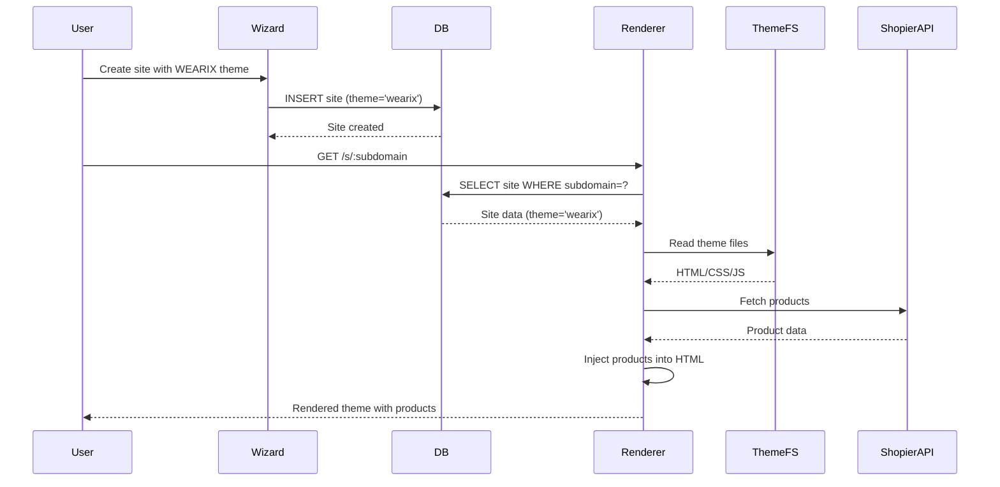

# Design Document: Framer WEARIX Theme Integration

## Overview

Bu tasarım, Framer'da hazırlanan WEARIX temasının (https://odelinktheme.framer.ai) Odelink projesine entegrasyonunu tanımlar. Entegrasyon, mevcut site oluşturma ve rendering altyapısını genişleterek, kullanıcıların modern bir e-ticaret teması ile Shopier ürünlerini sergilemesini sağlayacaktır.

### Design Goals

1. Framer temasının %100 orijinalliğini korumak
2. Mevcut Shopier entegrasyonunu kullanarak ürünleri dinamik olarak enjekte etmek
3. Site oluşturma wizard'ına tema seçim özelliği eklemek
4. Performanslı ve güvenli bir rendering sistemi oluşturmak
5. Minimal kod değişikliği ile maksimum etki sağlamak

### Key Constraints

- Framer'ın ücretsiz planında HTML export özelliği olmadığı için web scraping kullanılacak
- Tema dosyaları backend/themes/wearix/ klasöründe saklanacak
- Mevcut `/s/:subdomain` route'u genişletilecek (yeniden yazılmayacak)
- Shopier ürün verisi mevcut API'ler üzerinden çekilecek
- Veritabanı şemasına minimal değişiklik yapılacak (sadece theme sütunu)

## Architecture

### High-Level Architecture

```
┌─────────────────────────────────────────────────────────────┐
│                     User Request Flow                        │
└─────────────────────────────────────────────────────────────┘
                              │
                              ▼
                    ┌──────────────────┐
                    │  Express Server  │
                    │  (server.js)     │
                    └──────────────────┘
                              │
                ┌─────────────┴─────────────┐
                │                           │
                ▼                           ▼
    ┌──────────────────────┐    ┌──────────────────────┐
    │  Site Builder        │    │  Site Renderer       │
    │  (Wizard UI)         │    │  (/s/:subdomain)     │
    └──────────────────────┘    └──────────────────────┘
                │                           │
                │                           ▼
                │               ┌──────────────────────┐
                │               │  Theme Selector      │
                │               │  (checks theme col)  │
                │               └──────────────────────┘
                │                           │
                ▼               ┌───────────┴───────────┐
    ┌──────────────────────┐   │                       │
    │  Database (sites)    │   ▼                       ▼
    │  - theme: 'wearix'   │  ┌──────────┐   ┌──────────────┐
    └──────────────────────┘  │  WEARIX  │   │  Simple HTML │
                              │  Theme   │   │  (theme=NULL)│
                              └──────────┘   └──────────────┘
                                    │
                        ┌───────────┴───────────┐
                        │                       │
                        ▼                       ▼
            ┌──────────────────┐   ┌──────────────────────┐
            │  Static Files    │   │  Product Injector    │
            │  (CSS/JS/Images) │   │  (Shopier API)       │
            └──────────────────┘   └──────────────────────┘
```

### Component Interaction



## Components and Interfaces

### 1. Theme Scraper Service

**Purpose:** Framer sitesini indirip backend/themes/wearix/ klasörüne kaydetmek

**Location:** `backend/services/themeScraperService.js` (yeni dosya)

**Interface:**
```javascript
class ThemeScraperService {
  /**
   * Framer sitesini indir ve kaydet
   * @param {string} url - Framer site URL'i
   * @param {string} targetDir - Hedef klasör
   * @returns {Promise<{success: boolean, message: string, files: string[]}>}
   */
  async scrapeFramerSite(url, targetDir)
  
  /**
   * İndirilen dosyaları doğrula
   * @param {string} targetDir - Kontrol edilecek klasör
   * @returns {Promise<{valid: boolean, missingFiles: string[]}>}
   */
  async validateThemeFiles(targetDir)
}
```

**Dependencies:**
- `child_process.execSync` - wget/httrack komutlarını çalıştırmak için
- `fs/promises` - Dosya sistemi işlemleri
- `path` - Dosya yolu işlemleri

**Implementation Notes:**
- wget veya httrack kullanarak siteyi indirecek
- Göreceli URL'leri koruyacak (`--convert-links` flag)
- Hata durumunda detaylı log verecek
- İndirme başarısız olursa retry mekanizması olmayacak (manuel müdahale gerekecek)

### 2. Theme Storage

**Purpose:** Tema dosyalarını organize bir şekilde saklamak

**Location:** `backend/themes/wearix/` (klasör yapısı)

**Structure:**
```
backend/themes/wearix/
├── index.html          # Ana HTML dosyası
├── css/
│   └── framer.*.css    # Framer CSS dosyaları
├── js/
│   └── framer.*.js     # Framer JavaScript dosyaları
├── images/
│   └── *.png, *.jpg    # Görsel dosyalar
└── fonts/
    └── *.woff, *.woff2 # Font dosyaları
```

**Access Pattern:**
- Sadece okuma erişimi (read-only)
- Express static middleware ile serve edilecek
- Cache header'ları ile performans optimize edilecek

### 3. Database Schema Update

**Purpose:** Sitelerin hangi temayı kullandığını takip etmek

**Migration:** `backend/migrations/add-theme-column.sql` (yeni dosya)

**Schema Change:**
```sql
-- Add theme column to sites table
ALTER TABLE sites 
ADD COLUMN IF NOT EXISTS theme VARCHAR(50) DEFAULT NULL;

-- Create index for performance
CREATE INDEX IF NOT EXISTS idx_sites_theme ON sites(theme);

-- Update existing sites to NULL (they don't use themes)
-- New sites will explicitly set theme='wearix' or leave NULL
```

**Notes:**
- Mevcut `theme` sütunu zaten var ama VARCHAR(20) - VARCHAR(50)'ye genişletilecek
- Default değer NULL olacak (eski siteler tema kullanmıyor)
- 'wearix' değeri yeni siteler için kullanılacak

### 4. Site Builder UI Enhancement

**Purpose:** Wizard'a tema seçim adımı eklemek

**Location:** Frontend site builder component (mevcut wizard'ı genişletecek)

**UI Flow:**
```
Step 1: Site Bilgileri (name, shopierUrl)
Step 2: Tema Seçimi (NEW)
  ├── [ ] Tema Kullan (checkbox)
  └── [x] WEARIX - Modern Giyim E-ticaret
        └── [Preview Image]
        └── "Premium tasarım, modern layout"
Step 3: Önizleme ve Oluştur
```

**API Integration:**
```javascript
// POST /api/sites
{
  name: "Site Adı",
  shopierUrl: "https://...",
  settings: {
    theme: "wearix"  // veya null
  }
}
```

### 5. Product Injector

**Purpose:** Shopier ürünlerini tema HTML'ine enjekte etmek

**Location:** `backend/services/productInjectorService.js` (yeni dosya)

**Interface:**
```javascript
class ProductInjectorService {
  /**
   * Ürün verilerini tema HTML'ine enjekte et
   * @param {string} themeHtml - Tema HTML içeriği
   * @param {Array} products - Shopier ürün listesi
   * @param {Object} siteSettings - Site ayarları
   * @returns {string} - Enjekte edilmiş HTML
   */
  injectProducts(themeHtml, products, siteSettings)
  
  /**
   * Ürün verilerini JSON formatına dönüştür
   * @param {Array} products - Ham ürün verisi
   * @returns {Array} - Formatlanmış ürün verisi
   */
  formatProducts(products)
}
```

**Injection Strategy:**
```html
<!-- Tema HTML'ine enjekte edilecek kod -->
<script>
window.ODELINK_PRODUCTS = [
  {
    id: "123",
    name: "Ürün Adı",
    price: "299.00",
    currency: "TRY",
    image: "https://cdn.shopier.com/...",
    url: "https://www.shopier.com/...",
    description: "Ürün açıklaması",
    sizes: ["S", "M", "L", "XL"],
    images: ["url1", "url2"]
  }
];

window.ODELINK_SITE = {
  name: "Site Adı",
  subdomain: "subdomain",
  currency: "TRY"
};
</script>
```

**Implementation Notes:**
- Enjeksiyon `</head>` tag'inden önce yapılacak
- XSS koruması için ürün verisi sanitize edilecek
- JSON.stringify ile güvenli serialize edilecek

### 6. Site Renderer Enhancement

**Purpose:** `/s/:subdomain` route'unu genişleterek tema desteği eklemek

**Location:** `backend/server.js` (mevcut route'u güncelleyecek)

**Current Implementation:**
```javascript
app.get('/s/:subdomain*', async (req, res, next) => {
  // Basit HTML mesajı döndürüyor
});
```

**New Implementation:**
```javascript
app.get('/s/:subdomain*', async (req, res, next) => {
  const subdomain = req.params.subdomain;
  const requestedPath = req.params[0] || '';
  
  const site = await Site.findBySubdomain(subdomain);
  
  if (!site || site.status !== 'active') {
    return res.status(404).send('Site not found');
  }
  
  // Theme routing
  if (site.theme === 'wearix') {
    return handleWearixTheme(req, res, site, requestedPath);
  }
  
  // Fallback: simple HTML
  return res.send(`<h1>${site.name}</h1>`);
});
```

**Theme Handler:**
```javascript
async function handleWearixTheme(req, res, site, requestedPath) {
  const themeDir = path.join(__dirname, 'themes', 'wearix');
  
  // Static file request (CSS, JS, images)
  if (requestedPath && requestedPath !== '/') {
    const filePath = path.join(themeDir, requestedPath);
    if (fs.existsSync(filePath)) {
      return res.sendFile(filePath);
    }
    return res.status(404).send('File not found');
  }
  
  // HTML request - inject products
  const htmlPath = path.join(themeDir, 'index.html');
  let html = await fs.promises.readFile(htmlPath, 'utf-8');
  
  // Fetch products
  const products = await fetchShopierProducts(site);
  
  // Inject products
  html = productInjector.injectProducts(html, products, site.settings);
  
  // Set cache headers
  res.setHeader('Cache-Control', 'public, max-age=300'); // 5 minutes
  res.setHeader('Content-Type', 'text/html; charset=utf-8');
  
  return res.send(html);
}
```

### 7. Static File Serving

**Purpose:** Tema statik dosyalarını (CSS, JS, images) serve etmek

**Implementation:**
```javascript
// Express static middleware for theme files
app.use('/s/:subdomain', (req, res, next) => {
  // Only for static files, not HTML
  if (req.path.match(/\.(css|js|png|jpg|jpeg|svg|woff|woff2)$/)) {
    const subdomain = req.params.subdomain;
    Site.findBySubdomain(subdomain).then(site => {
      if (site && site.theme === 'wearix') {
        const themeDir = path.join(__dirname, 'themes', 'wearix');
        express.static(themeDir)(req, res, next);
      } else {
        next();
      }
    });
  } else {
    next();
  }
});
```

## Data Models

### Site Model Extension

**Current Schema:**
```sql
CREATE TABLE sites (
  id UUID PRIMARY KEY,
  user_id UUID REFERENCES users(id),
  name VARCHAR(100),
  shopier_url TEXT,
  theme VARCHAR(20) DEFAULT 'modern',  -- EXISTING
  subdomain VARCHAR(100) UNIQUE,
  custom_domain VARCHAR(255),
  status VARCHAR(20) DEFAULT 'active',
  settings JSONB,
  created_at TIMESTAMP,
  updated_at TIMESTAMP
);
```

**Updated Schema:**
```sql
-- Extend theme column
ALTER TABLE sites ALTER COLUMN theme TYPE VARCHAR(50);

-- Update default to NULL
ALTER TABLE sites ALTER COLUMN theme SET DEFAULT NULL;

-- Valid values: NULL, 'wearix'
-- NULL = no theme (simple HTML)
-- 'wearix' = WEARIX Framer theme
```

### Settings JSONB Structure

**For WEARIX themed sites:**
```json
{
  "theme": "wearix",
  "products_data": [...],  // Existing Shopier products
  "collections": [...],     // Existing collections
  "contact": {
    "email": "...",
    "phone": "..."
  },
  "policies": {
    "privacy": "...",
    "terms": "...",
    "returns": "..."
  }
}
```

## Error Handling

### Theme Scraper Errors

**Error Types:**
1. Network errors (Framer site unreachable)
2. File system errors (permission denied)
3. wget/httrack not installed
4. Incomplete download

**Handling Strategy:**
```javascript
try {
  await themeScraperService.scrapeFramerSite(url, targetDir);
} catch (error) {
  console.error('Theme scraping failed:', error);
  // Log to file for manual intervention
  // Do NOT crash the server
  // Return error to admin
}
```

### Site Rendering Errors

**Error Types:**
1. Theme files not found
2. Product fetch timeout
3. HTML injection failure

**Handling Strategy:**
```javascript
try {
  return await handleWearixTheme(req, res, site, requestedPath);
} catch (error) {
  console.error('Theme rendering failed:', error);
  // Fallback to simple HTML
  return res.send(`
    <h1>${site.name}</h1>
    <p>Tema yüklenemedi. Lütfen daha sonra tekrar deneyin.</p>
  `);
}
```

### Product Injection Errors

**Error Types:**
1. Shopier API timeout
2. Invalid product data
3. XSS attempt in product data

**Handling Strategy:**
```javascript
try {
  const products = await fetchShopierProducts(site);
  return productInjector.injectProducts(html, products, site.settings);
} catch (error) {
  console.error('Product injection failed:', error);
  // Inject empty array
  return productInjector.injectProducts(html, [], site.settings);
}
```

## Testing Strategy

### Unit Tests

**Theme Scraper Service:**
- Test wget command generation
- Test file validation logic
- Test error handling

**Product Injector Service:**
- Test JSON serialization
- Test XSS sanitization
- Test HTML injection placement

**Site Model:**
- Test theme column update
- Test findBySubdomain with theme filter

### Integration Tests

**Site Creation Flow:**
- Create site with theme='wearix'
- Verify database record
- Verify theme is selectable in wizard

**Site Rendering Flow:**
- Request /s/:subdomain for WEARIX site
- Verify HTML contains injected products
- Verify static files are served correctly

**Product Injection Flow:**
- Mock Shopier API response
- Verify products are injected into HTML
- Verify XSS protection works

### Manual Testing Checklist

- [ ] Framer site scraping works
- [ ] Theme files are saved correctly
- [ ] Wizard shows theme selection
- [ ] Site creation with theme works
- [ ] /s/:subdomain renders WEARIX theme
- [ ] Products are displayed correctly
- [ ] Static files (CSS/JS/images) load
- [ ] Cache headers are set correctly
- [ ] Fallback to simple HTML works
- [ ] XSS protection works

## Security Considerations

### XSS Protection

**Product Data Sanitization:**
```javascript
function sanitizeProductData(products) {
  return products.map(p => ({
    id: String(p.id || '').slice(0, 100),
    name: escapeHtml(String(p.name || '')).slice(0, 200),
    price: Number(p.price) || 0,
    image: sanitizeUrl(p.image),
    url: sanitizeUrl(p.url),
    description: escapeHtml(String(p.description || '')).slice(0, 1000)
  }));
}
```

### SQL Injection Protection

**Subdomain Validation:**
```javascript
function validateSubdomain(subdomain) {
  // Only allow alphanumeric and hyphens
  if (!/^[a-z0-9-]+$/.test(subdomain)) {
    throw new Error('Invalid subdomain');
  }
  return subdomain.toLowerCase();
}
```

### Path Traversal Protection

**Static File Serving:**
```javascript
function serveThemeFile(requestedPath) {
  const themeDir = path.join(__dirname, 'themes', 'wearix');
  const filePath = path.join(themeDir, requestedPath);
  
  // Prevent path traversal
  if (!filePath.startsWith(themeDir)) {
    throw new Error('Invalid file path');
  }
  
  return filePath;
}
```

### Content Security Policy

**Headers:**
```javascript
res.setHeader('Content-Security-Policy', 
  "default-src 'self'; " +
  "script-src 'self' 'unsafe-inline' https://cdn.shopier.com; " +
  "style-src 'self' 'unsafe-inline'; " +
  "img-src 'self' data: https:; " +
  "font-src 'self' data:;"
);
res.setHeader('X-Frame-Options', 'SAMEORIGIN');
res.setHeader('X-Content-Type-Options', 'nosniff');
```

## Performance Optimization

### Caching Strategy

**HTML Caching:**
```javascript
// In-memory cache for rendered HTML
const htmlCache = new Map();

function getCachedHtml(subdomain) {
  const cached = htmlCache.get(subdomain);
  if (cached && Date.now() - cached.timestamp < 5 * 60 * 1000) {
    return cached.html;
  }
  return null;
}

function setCachedHtml(subdomain, html) {
  htmlCache.set(subdomain, {
    html,
    timestamp: Date.now()
  });
}
```

**Static File Caching:**
```javascript
// HTTP cache headers for static files
res.setHeader('Cache-Control', 'public, max-age=86400'); // 1 day
res.setHeader('ETag', generateETag(filePath));
```

### Compression

**Gzip Compression:**
```javascript
// Already enabled in server.js
app.use(compression());
```

### Product Data Optimization

**Minimize JSON:**
```javascript
function minimizeProductData(products) {
  return products.map(p => ({
    i: p.id,           // id -> i
    n: p.name,         // name -> n
    p: p.price,        // price -> p
    m: p.image,        // image -> m
    u: p.url           // url -> u
  }));
}
```

## Deployment Strategy

### Phase 1: Theme Scraping (Manual)

1. Geliştirici lokal olarak wget/httrack ile Framer sitesini indirir
2. İndirilen dosyaları backend/themes/wearix/ klasörüne kopyalar
3. Git'e commit eder
4. Production'a deploy eder

**Command:**
```bash
# Local development
cd backend/themes
mkdir -p wearix
wget --mirror --convert-links --adjust-extension --page-requisites --no-parent \
  https://odelinktheme.framer.ai -P wearix/

# Verify files
ls -la wearix/
```

### Phase 2: Database Migration

1. Migration script'i çalıştır
2. Mevcut sitelerin theme değerini kontrol et
3. Yeni sitelerin theme='wearix' ile oluşturulabildiğini doğrula

**Command:**
```bash
# Run migration
psql $DATABASE_URL -f backend/migrations/add-theme-column.sql

# Verify
psql $DATABASE_URL -c "SELECT id, name, theme FROM sites LIMIT 5;"
```

### Phase 3: Code Deployment

1. Backend kod değişikliklerini deploy et
2. Frontend wizard güncellemesini deploy et
3. Smoke test yap

**Verification:**
```bash
# Test theme rendering
curl https://www.odelink.shop/s/test-subdomain

# Test wizard
# Manuel olarak yeni site oluştur ve tema seç
```

### Phase 4: Monitoring

1. Error log'ları izle
2. Performance metrics'leri izle
3. User feedback topla

**Metrics:**
- Theme rendering latency
- Cache hit rate
- Error rate
- User adoption rate

## Rollback Plan

### If Theme Rendering Fails

1. `/s/:subdomain` route'unu eski haline döndür
2. Basit HTML mesajı göster
3. Theme dosyalarını kontrol et

### If Database Migration Fails

1. Migration'ı rollback et
2. theme sütununu kaldır
3. Eski şemaya dön

### If Product Injection Fails

1. Boş ürün array'i ile render et
2. Fallback mesajı göster
3. Shopier API'yi kontrol et

## Future Enhancements

### Multiple Theme Support

- backend/themes/ klasörüne yeni temalar eklenebilir
- Wizard'da tema seçim dropdown'u genişletilebilir
- Her tema için ayrı product injector stratejisi olabilir

### Theme Customization

- Renk paleti özelleştirme
- Logo değiştirme
- Font seçimi
- Layout varyasyonları

### Theme Marketplace

- Kullanıcılar kendi temalarını yükleyebilir
- Premium temalar satılabilir
- Tema preview sistemi

### Auto-Update

- Framer sitesi değiştiğinde otomatik güncelleme
- Webhook ile tetikleme
- Version control

## Appendix

### Glossary

- **WEARIX_Theme**: Framer'da hazırlanan modern giyim e-ticaret teması
- **Theme_Scraper**: Framer sitesini indiren web scraping servisi
- **Theme_Storage**: İndirilen tema dosyalarının saklandığı klasör
- **Site_Builder**: Kullanıcıların yeni site oluşturduğu wizard arayüzü
- **Product_Injector**: Shopier ürünlerini temaya dinamik olarak ekleyen servis
- **Site_Renderer**: /s/:subdomain route'unda siteleri serve eden sistem

### References

- Framer Site: https://odelinktheme.framer.ai
- Shopier API Documentation: (internal)
- Express.js Documentation: https://expressjs.com
- PostgreSQL JSONB: https://www.postgresql.org/docs/current/datatype-json.html

### Change Log

- 2025-01-XX: Initial design document created
