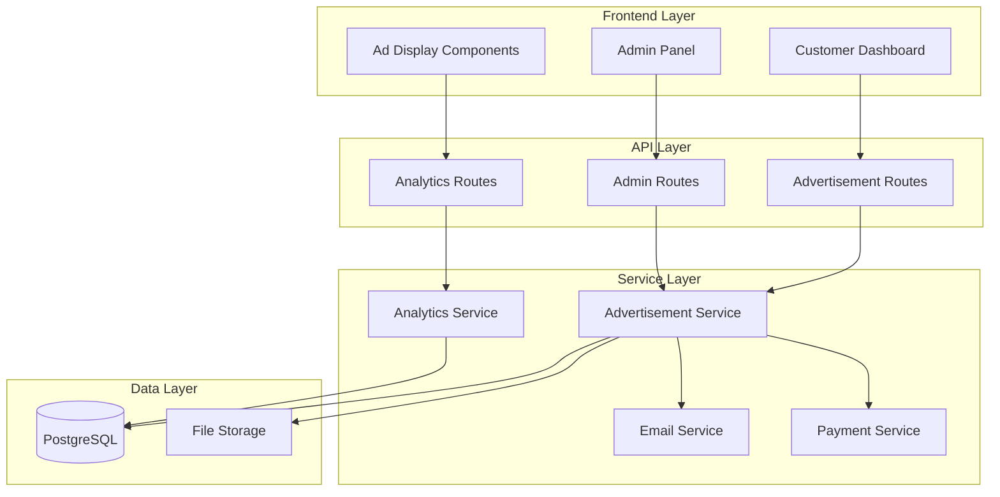

# Design Document: Shopier Store Advertising System

## Overview

The Shopier Store Advertising System is a comprehensive advertising management platform that enables Shopier store owners to purchase and display advertisements on the Odelink platform. The system consists of three main components:

1. **Customer Interface**: Advertisement submission, payment processing, and statistics dashboard
2. **Admin Interface**: Advertisement approval, management, and analytics
3. **Display System**: Dynamic ad rendering with real-time impression and click tracking

The system integrates with the existing Odelink infrastructure, leveraging PostgreSQL for data storage, Express.js for API endpoints, and React for the frontend interface.

### Key Design Principles

- **Simplicity**: Follow existing codebase patterns (PostgreSQL models, Express routes, React components)
- **Security**: Input validation, authentication, authorization, and rate limiting
- **Performance**: Caching, database indexing, and optimized queries
- **Scalability**: Efficient tracking, pagination, and background processing
- **Maintainability**: Clear separation of concerns, consistent naming conventions

## Architecture

### System Components



### Technology Stack

- **Backend**: Node.js, Express.js, PostgreSQL
- **Frontend**: React, Framer Motion, Lucide Icons
- **Authentication**: JWT tokens (existing auth middleware)
- **File Upload**: Multer (existing pattern)
- **Email**: Nodemailer (existing pattern)
- **Payment**: Shopier Payment Gateway

## Components and Interfaces

### Database Models

#### Advertisement Model

**Table**: `advertisements`

```sql
CREATE TABLE advertisements (
  id UUID PRIMARY KEY DEFAULT uuid_generate_v4(),
  user_id UUID NOT NULL REFERENCES users(id) ON DELETE CASCADE,
  shopier_url VARCHAR(500) NOT NULL,
  brand_name VARCHAR(100) NOT NULL,
  instagram_handle VARCHAR(100),
  description TEXT,
  logo_url VARCHAR(500),
  pricing_tier VARCHAR(20) NOT NULL CHECK (pricing_tier IN ('baslangic', 'profesyonel', 'premium')),
  status VARCHAR(20) NOT NULL DEFAULT 'pending' CHECK (status IN ('pending', 'approved', 'rejected', 'active', 'expired')),
  placement_position VARCHAR(50),
  start_date TIMESTAMP,
  end_date TIMESTAMP,
  payment_status VARCHAR(20) DEFAULT 'unpaid' CHECK (payment_status IN ('unpaid', 'paid', 'refunded')),
  payment_method VARCHAR(50),
  payment_transaction_id VARCHAR(255),
  payment_amount DECIMAL(10,2),
  payment_date TIMESTAMP,
  payment_reference VARCHAR(100),
  rejection_reason TEXT,
  created_at TIMESTAMP DEFAULT CURRENT_TIMESTAMP,
  updated_at TIMESTAMP DEFAULT CURRENT_TIMESTAMP
);

-- Indexes for performance
CREATE INDEX idx_advertisements_user_id ON advertisements(user_id);
CREATE INDEX idx_advertisements_status ON advertisements(status);
CREATE INDEX idx_advertisements_payment_status ON advertisements(payment_status);
CREATE INDEX idx_advertisements_active ON advertisements(status, start_date, end_date) 
  WHERE status = 'active';
CREATE INDEX idx_advertisements_placement ON advertisements(placement_position, status) 
  WHERE status = 'active';
```

#### Advertisement Statistics Model

**Table**: `advertisement_statistics`

```sql
CREATE TABLE advertisement_statistics (
  id UUID PRIMARY KEY DEFAULT uuid_generate_v4(),
  advertisement_id UUID NOT NULL REFERENCES advertisements(id) ON DELETE CASCADE,
  impressions INTEGER DEFAULT 0,
  clicks INTEGER DEFAULT 0,
  brand_link_clicks INTEGER DEFAULT 0,
  cta_button_clicks INTEGER DEFAULT 0,
  instagram_link_clicks INTEGER DEFAULT 0,
  last_updated TIMESTAMP DEFAULT CURRENT_TIMESTAMP,
  UNIQUE(advertisement_id)
);

CREATE INDEX idx_ad_stats_ad_id ON advertisement_statistics(advertisement_id);
```

#### Hourly Breakdown Model

**Table**: `advertisement_hourly_stats`

```sql
CREATE TABLE advertisement_hourly_stats (
  id UUID PRIMARY KEY DEFAULT uuid_generate_v4(),
  advertisement_id UUID NOT NULL REFERENCES advertisements(id) ON DELETE CASCADE,
  hour_timestamp TIMESTAMP NOT NULL,
  impressions INTEGER DEFAULT 0,
  clicks INTEGER DEFAULT 0,
  created_at TIMESTAMP DEFAULT CURRENT_TIMESTAMP,
  UNIQUE(advertisement_id, hour_timestamp)
);

CREATE INDEX idx_ad_hourly_ad_id ON advertisement_hourly_stats(advertisement_id);
CREATE INDEX idx_ad_hourly_timestamp ON advertisement_hourly_stats(hour_timestamp);
```

#### Impression Tracking (Session Storage)

**Table**: `advertisement_impression_tracking`

```sql
CREATE TABLE advertisement_impression_tracking (
  id UUID PRIMARY KEY DEFAULT uuid_generate_v4(),
  advertisement_id UUID NOT NULL REFERENCES advertisements(id) ON DELETE CASCADE,
  visitor_id VARCHAR(128),
  ip_address VARCHAR(64),
  user_agent TEXT,
  tracked_at TIMESTAMP DEFAULT CURRENT_TIMESTAMP
);

CREATE INDEX idx_ad_tracking_ad_id ON advertisement_impression_tracking(advertisement_id);
CREATE INDEX idx_ad_tracking_visitor ON advertisement_impression_tracking(visitor_id, tracked_at);
CREATE INDEX idx_ad_tracking_cleanup ON advertisement_impression_tracking(tracked_at);
```

### Backend Services

#### Advertisement Service

**File**: `backend/services/advertisementService.js`

```javascript
const pool = require('../config/database');
const crypto = require('crypto');

class AdvertisementService {
  // Create advertisement
  static async create(data) {
    const { userId, shopierUrl, brandName, instagramHandle, description, logoUrl, pricingTier } = data;
    
    const query = `
      INSERT INTO advertisements (
        user_id, shopier_url, brand_name, instagram_handle, 
        description, logo_url, pricing_tier, status, payment_reference
      )
      VALUES ($1, $2, $3, $4, $5, $6, $7, 'pending', $8)
      RETURNING *
    `;
    
    const paymentReference = `AD-${Date.now()}-${crypto.randomBytes(4).toString('hex').toUpperCase()}`;
    
    const result = await pool.query(query, [
      userId, shopierUrl, brandName, instagramHandle,
      description, logoUrl, pricingTier, paymentReference
    ]);
    
    // Initialize statistics
    await pool.query(
      'INSERT INTO advertisement_statistics (advertisement_id) VALUES ($1)',
      [result.rows[0].id]
    );
    
    return result.rows[0];
  }
  
  // Get active advertisements by placement
  static async getActiveByPlacement(placement) {
    const query = `
      SELECT a.*, s.impressions, s.clicks
      FROM advertisements a
      LEFT JOIN advertisement_statistics s ON s.advertisement_id = a.id
      WHERE a.status = 'active'
        AND a.placement_position = $1
        AND a.start_date <= NOW()
        AND a.end_date >= NOW()
      ORDER BY RANDOM()
      LIMIT 1
    `;
    
    const result = await pool.query(query, [placement]);
    return result.rows[0] || null;
  }
  
  // Get user's advertisements
  static async getByUserId(userId) {
    const query = `
      SELECT a.*, s.impressions, s.clicks
      FROM advertisements a
      LEFT JOIN advertisement_statistics s ON s.advertisement_id = a.id
      WHERE a.user_id = $1
      ORDER BY a.created_at DESC
    `;
    
    const result = await pool.query(query, [userId]);
    return result.rows;
  }
  
  // Update advertisement status
  static async updateStatus(id, status, additionalData = {}) {
    const fields = ['status = $2', 'updated_at = NOW()'];
    const values = [id, status];
    let paramIndex = 3;
    
    if (additionalData.startDate) {
      fields.push(`start_date = $${paramIndex}`);
      values.push(additionalData.startDate);
      paramIndex++;
    }
    
    if (additionalData.endDate) {
      fields.push(`end_date = $${paramIndex}`);
      values.push(additionalData.endDate);
      paramIndex++;
    }
    
    if (additionalData.placementPosition) {
      fields.push(`placement_position = $${paramIndex}`);
      values.push(additionalData.placementPosition);
      paramIndex++;
    }
    
    if (additionalData.rejectionReason) {
      fields.push(`rejection_reason = $${paramIndex}`);
      values.push(additionalData.rejectionReason);
      paramIndex++;
    }
    
    const query = `
      UPDATE advertisements
      SET ${fields.join(', ')}
      WHERE id = $1
      RETURNING *
    `;
    
    const result = await pool.query(query, values);
    return result.rows[0];
  }
  
  // Update payment status
  static async updatePayment(id, paymentData) {
    const query = `
      UPDATE advertisements
      SET payment_status = $2,
          payment_method = $3,
          payment_transaction_id = $4,
          payment_amount = $5,
          payment_date = NOW(),
          updated_at = NOW()
      WHERE id = $1
      RETURNING *
    `;
    
    const result = await pool.query(query, [
      id,
      paymentData.status,
      paymentData.method,
      paymentData.transactionId,
      paymentData.amount
    ]);
    
    return result.rows[0];
  }
  
  // Auto-update expired advertisements
  static async updateExpiredAds() {
    const query = `
      UPDATE advertisements
      SET status = 'expired', updated_at = NOW()
      WHERE status = 'active'
        AND end_date < NOW()
      RETURNING id
    `;
    
    const result = await pool.query(query);
    return result.rows.length;
  }
  
  // Auto-activate approved advertisements
  static async activateApprovedAds() {
    const query = `
      UPDATE advertisements
      SET status = 'active', updated_at = NOW()
      WHERE status = 'approved'
        AND start_date <= NOW()
        AND end_date >= NOW()
        AND payment_status = 'paid'
      RETURNING id
    `;
    
    const result = await pool.query(query);
    return result.rows.length;
  }
}

module.exports = AdvertisementService;
```

#### Analytics Service

**File**: `backend/services/advertisementAnalyticsService.js`

```javascript
const pool = require('../config/database');

class AdvertisementAnalyticsService {
  // Record impression
  static async recordImpression(advertisementId, visitorId, ipAddress, userAgent) {
    // Check for duplicate within 30 seconds
    const checkQuery = `
      SELECT id FROM advertisement_impression_tracking
      WHERE advertisement_id = $1
        AND visitor_id = $2
        AND tracked_at > NOW() - INTERVAL '30 seconds'
      LIMIT 1
    `;
    
    const existing = await pool.query(checkQuery, [advertisementId, visitorId]);
    if (existing.rows.length > 0) {
      return { recorded: false, reason: 'duplicate' };
    }
    
    // Record tracking
    await pool.query(
      `INSERT INTO advertisement_impression_tracking 
       (advertisement_id, visitor_id, ip_address, user_agent)
       VALUES ($1, $2, $3, $4)`,
      [advertisementId, visitorId, ipAddress, userAgent]
    );
    
    // Update statistics
    await pool.query(
      `UPDATE advertisement_statistics
       SET impressions = impressions + 1, last_updated = NOW()
       WHERE advertisement_id = $1`,
      [advertisementId]
    );
    
    // Update hourly breakdown
    const hour = new Date();
    hour.setMinutes(0, 0, 0);
    
    await pool.query(
      `INSERT INTO advertisement_hourly_stats (advertisement_id, hour_timestamp, impressions, clicks)
       VALUES ($1, $2, 1, 0)
       ON CONFLICT (advertisement_id, hour_timestamp)
       DO UPDATE SET impressions = advertisement_hourly_stats.impressions + 1`,
      [advertisementId, hour]
    );
    
    return { recorded: true };
  }
  
  // Record click
  static async recordClick(advertisementId, clickType, visitorId) {
    // Check for duplicate within 5 seconds
    const checkQuery = `
      SELECT id FROM advertisement_impression_tracking
      WHERE advertisement_id = $1
        AND visitor_id = $2
        AND tracked_at > NOW() - INTERVAL '5 seconds'
      LIMIT 1
    `;
    
    const existing = await pool.query(checkQuery, [advertisementId, visitorId]);
    if (existing.rows.length > 0) {
      return { recorded: false, reason: 'duplicate' };
    }
    
    // Update statistics
    const clickField = clickType === 'brand-link' ? 'brand_link_clicks' :
                      clickType === 'cta-button' ? 'cta_button_clicks' :
                      clickType === 'instagram-link' ? 'instagram_link_clicks' : null;
    
    if (clickField) {
      await pool.query(
        `UPDATE advertisement_statistics
         SET clicks = clicks + 1, ${clickField} = ${clickField} + 1, last_updated = NOW()
         WHERE advertisement_id = $1`,
        [advertisementId]
      );
    } else {
      await pool.query(
        `UPDATE advertisement_statistics
         SET clicks = clicks + 1, last_updated = NOW()
         WHERE advertisement_id = $1`,
        [advertisementId]
      );
    }
    
    // Update hourly breakdown
    const hour = new Date();
    hour.setMinutes(0, 0, 0);
    
    await pool.query(
      `INSERT INTO advertisement_hourly_stats (advertisement_id, hour_timestamp, impressions, clicks)
       VALUES ($1, $2, 0, 1)
       ON CONFLICT (advertisement_id, hour_timestamp)
       DO UPDATE SET clicks = advertisement_hourly_stats.clicks + 1`,
      [advertisementId, hour]
    );
    
    return { recorded: true };
  }
  
  // Get statistics for advertisement
  static async getStatistics(advertisementId, days = 30) {
    const statsQuery = `
      SELECT * FROM advertisement_statistics
      WHERE advertisement_id = $1
    `;
    
    const hourlyQuery = `
      SELECT hour_timestamp, impressions, clicks
      FROM advertisement_hourly_stats
      WHERE advertisement_id = $1
        AND hour_timestamp >= NOW() - INTERVAL '${days} days'
      ORDER BY hour_timestamp DESC
    `;
    
    const [stats, hourly] = await Promise.all([
      pool.query(statsQuery, [advertisementId]),
      pool.query(hourlyQuery, [advertisementId])
    ]);
    
    return {
      total: stats.rows[0] || { impressions: 0, clicks: 0 },
      hourly: hourly.rows
    };
  }
  
  // Cleanup old tracking data (run daily)
  static async cleanupOldTracking(daysToKeep = 7) {
    const query = `
      DELETE FROM advertisement_impression_tracking
      WHERE tracked_at < NOW() - INTERVAL '${daysToKeep} days'
    `;
    
    const result = await pool.query(query);
    return result.rowCount;
  }
}

module.exports = AdvertisementAnalyticsService;
```

### API Endpoints

#### Advertisement Routes

**File**: `backend/routes/advertisements.js`

```javascript
const express = require('express');
const Joi = require('joi');
const multer = require('multer');
const path = require('path');
const crypto = require('crypto');
const authMiddleware = require('../middleware/auth');
const { rateLimiters } = require('../middleware/rateLimiters');
const AdvertisementService = require('../services/advertisementService');
const AdvertisementAnalyticsService = require('../services/advertisementAnalyticsService');

const router = express.Router();

// File upload configuration
const storage = multer.diskStorage({
  destination: (req, file, cb) => {
    cb(null, 'uploads/logos');
  },
  filename: (req, file, cb) => {
    const uniqueName = `${crypto.randomUUID()}-${Date.now()}${path.extname(file.originalname)}`;
    cb(null, uniqueName);
  }
});

const upload = multer({
  storage,
  limits: { fileSize: 5 * 1024 * 1024 }, // 5MB
  fileFilter: (req, file, cb) => {
    const allowedTypes = ['image/png', 'image/jpeg', 'image/jpg', 'image/svg+xml'];
    if (allowedTypes.includes(file.mimetype)) {
      cb(null, true);
    } else {
      cb(new Error('Invalid file type. Only PNG, JPG, JPEG, SVG allowed.'));
    }
  }
});

// Validation schemas
const createAdSchema = Joi.object({
  shopierUrl: Joi.string().uri().pattern(/shopier\.com/).required(),
  brandName: Joi.string().min(2).max(100).required(),
  instagramHandle: Joi.string().pattern(/^[a-zA-Z0-9_.]+$/).max(100).optional(),
  description: Joi.string().max(500).optional(),
  pricingTier: Joi.string().valid('baslangic', 'profesyonel', 'premium').required()
});

// POST /api/advertisements - Create new advertisement
router.post('/', 
  authMiddleware, 
  rateLimiters.createAd,
  upload.single('logo'),
  async (req, res) => {
    try {
      const { error, value } = createAdSchema.validate(req.body);
      if (error) {
        return res.status(400).json({ error: error.details[0].message });
      }
      
      const logoUrl = req.file ? `/uploads/logos/${req.file.filename}` : null;
      
      const advertisement = await AdvertisementService.create({
        userId: req.userId,
        ...value,
        logoUrl
      });
      
      return res.status(201).json({ advertisement });
    } catch (error) {
      console.error('Create advertisement error:', error);
      return res.status(500).json({ error: 'Advertisement could not be created' });
    }
  }
);

// GET /api/advertisements/my - Get user's advertisements
router.get('/my', authMiddleware, async (req, res) => {
  try {
    const advertisements = await AdvertisementService.getByUserId(req.userId);
    return res.json({ advertisements });
  } catch (error) {
    console.error('Get user advertisements error:', error);
    return res.status(500).json({ error: 'Advertisements could not be retrieved' });
  }
});

// GET /api/advertisements/:id - Get single advertisement
router.get('/:id', authMiddleware, async (req, res) => {
  try {
    const query = `
      SELECT a.*, s.impressions, s.clicks
      FROM advertisements a
      LEFT JOIN advertisement_statistics s ON s.advertisement_id = a.id
      WHERE a.id = $1
    `;
    
    const result = await pool.query(query, [req.params.id]);
    const ad = result.rows[0];
    
    if (!ad) {
      return res.status(404).json({ error: 'Advertisement not found' });
    }
    
    if (ad.user_id !== req.userId) {
      return res.status(403).json({ error: 'Access denied' });
    }
    
    return res.json({ advertisement: ad });
  } catch (error) {
    console.error('Get advertisement error:', error);
    return res.status(500).json({ error: 'Advertisement could not be retrieved' });
  }
});

// GET /api/advertisements/active - Get active advertisements (public)
router.get('/active', async (req, res) => {
  try {
    const placement = req.query.placement;
    
    if (!placement) {
      return res.status(400).json({ error: 'Placement parameter required' });
    }
    
    const ad = await AdvertisementService.getActiveByPlacement(placement);
    return res.json({ advertisement: ad });
  } catch (error) {
    console.error('Get active advertisements error:', error);
    return res.status(500).json({ error: 'Active advertisements could not be retrieved' });
  }
});

// POST /api/advertisements/:id/impression - Record impression
router.post('/:id/impression',
  rateLimiters.tracking,
  async (req, res) => {
    try {
      const visitorId = req.body.visitorId || req.sessionID || 'anonymous';
      const ipAddress = req.ip || req.connection.remoteAddress;
      const userAgent = req.headers['user-agent'];
      
      const result = await AdvertisementAnalyticsService.recordImpression(
        req.params.id,
        visitorId,
        ipAddress,
        userAgent
      );
      
      return res.json(result);
    } catch (error) {
      console.error('Record impression error:', error);
      return res.status(500).json({ error: 'Impression could not be recorded' });
    }
  }
);

// POST /api/advertisements/:id/click - Record click
router.post('/:id/click',
  rateLimiters.tracking,
  async (req, res) => {
    try {
      const visitorId = req.body.visitorId || req.sessionID || 'anonymous';
      const clickType = req.body.clickType || 'general';
      
      const result = await AdvertisementAnalyticsService.recordClick(
        req.params.id,
        clickType,
        visitorId
      );
      
      return res.json(result);
    } catch (error) {
      console.error('Record click error:', error);
      return res.status(500).json({ error: 'Click could not be recorded' });
    }
  }
);

// GET /api/advertisements/:id/statistics - Get advertisement statistics
router.get('/:id/statistics', authMiddleware, async (req, res) => {
  try {
    // Verify ownership
    const adQuery = 'SELECT user_id FROM advertisements WHERE id = $1';
    const adResult = await pool.query(adQuery, [req.params.id]);
    
    if (!adResult.rows[0]) {
      return res.status(404).json({ error: 'Advertisement not found' });
    }
    
    if (adResult.rows[0].user_id !== req.userId) {
      return res.status(403).json({ error: 'Access denied' });
    }
    
    const days = parseInt(req.query.days) || 30;
    const statistics = await AdvertisementAnalyticsService.getStatistics(req.params.id, days);
    
    return res.json({ statistics });
  } catch (error) {
    console.error('Get statistics error:', error);
    return res.status(500).json({ error: 'Statistics could not be retrieved' });
  }
});

module.exports = router;
```

