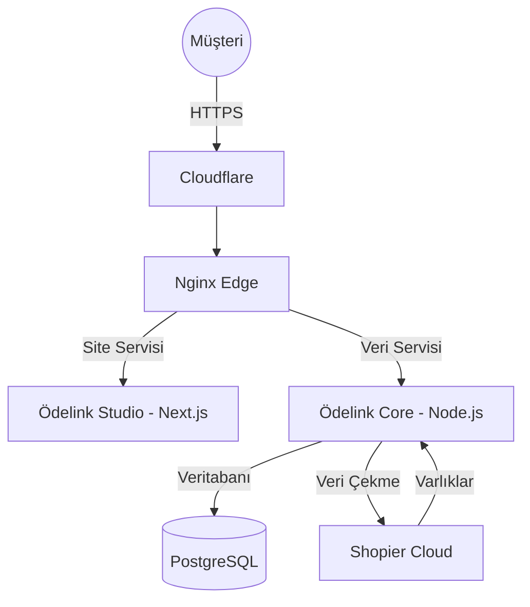

<div align="center">
  
  <h1>💎 Ödelink Enterprise</h1>
  <p><b>Türkiye'nin En Güçlü Şirketsiz E-Ticaret ve Showcase Altyapısı</b></p>

  <p>
    
    
    
    
  </p>
</div>

---

## 🚀 Ödelink Nedir?

**Ödelink Enterprise**, Shopier satıcıları için özel olarak geliştirilmiş, kurumsal düzeyde bir vitrin yönetim platformudur. Satıcıların teknik karmaşayla uğraşmadan, saniyeler içinde dünya standartlarında bir e-ticaret sitesine sahip olmasını sağlar. Ödelink, Shopier'in güvenli ödeme altyapısını premium tasarım ve gelişmiş otomasyon teknolojileriyle birleştirir.

## 🏛️ Ödelink Elite Özellikleri

*   ⚡ **Ultra-Hızlı Ürün Aktarımı:** Shopier linklerinizi yapıştırın, Ödelink saniyeler içinde tüm ürün verilerini (HD Resimler, Varyantlar, Açıklamalar) otomatik olarak ayıklasın.
*   🛡️ **Cyber-Armor Güvenlik:** Gelişmiş koruma kalkanları ile siteniz her türlü saldırıya karşı izole edilmiştir.
*   🎨 **Premium Vitrin Deneyimi:** Minimalist, hızlı ve dönüşüm odaklı tasarımlarla müşterilerinize elit bir alışveriş deneyimi sunun.
*   📉 **%0 Ek Komisyon:** Ödelink, Shopier altyapısını doğrudan kullanır; kazancınızdan ek komisyon almaz.

## 🛠️ Teknoloji Üstünlüğü

| Katman | Teknoloji |
| :--- | :--- |
| **Önyüz (Frontend)** | React 19, Next.js 16 (Studio Mode), Framer Motion |
| **Arkayüz (Backend)** | Node.js Elite Cluster, Express.js |
| **Veritabanı** | PostgreSQL (Relational Master) |
| **Altyapı** | Docker Engine, Nginx Reverse Proxy, PM2 |
| **Otomasyon** | Puppeteer Stealth Pro (Shopier Scraper) |
| **Ağ ve Güvenlik** | Cloudflare Enterprise DNS & WAF Integration |

## 📐 Sistem Mimarisi

Ödelink, kesintisiz hizmet için dağıtık bir yapı sunar.



## 📦 Hızlı Kurulum (Geliştiriciler İçin)

### 1. Sistem Hazırlığı
```bash
sudo apt update && sudo apt install git docker.io docker-compose -y
```

### 2. Depo Kurulumu
```bash
git clone https://github.com/odelinkshop/odelink-shop.git
cd odelink-shop
npm run install:all
```

### 3. Yapılandırma
`backend/.env` dosyasını `example` dosyasına göre doldurun.

### 4. Ateşleme
```bash
docker-compose up -d --build
```

## 📜 Lisans ve Güvenlik

Ödelink projesi **MIT Lisansı** ile korunmaktadır. Güvenlik bildirimleri için [SECURITY.md](SECURITY.md) dosyasını takip edin.

---

<div align="center">
  <p><i>Dijital geleceği Ödelink ile şekillendirin.</i></p>
  <p>🏛️ <b>Ödelink Enterprise © 2024-2026</b></p>
</div>
