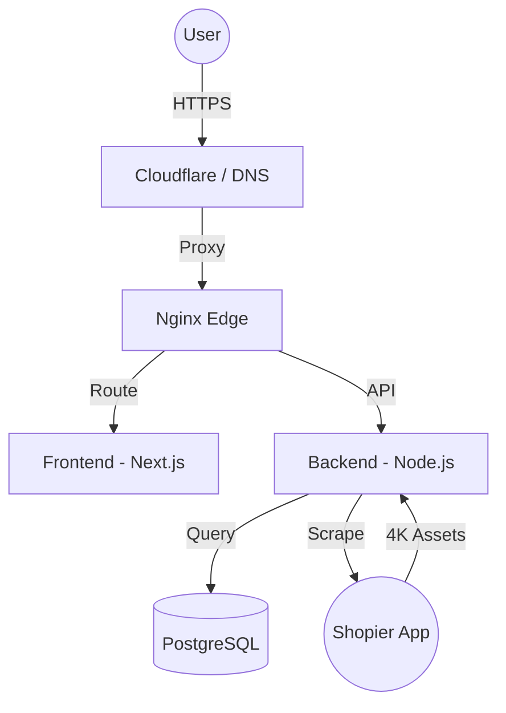

<div align="center">
  
  <h1>🏛️ Nova: Elite Shopier Showcase SaaS</h1>
  <p><strong>Transforming Shopier Stores into Premium E-Commerce Masterpieces in Seconds.</strong></p>

  [](https://opensource.org/licenses/MIT)
  [](#)
  [](#)
  [](#)
</div>

---

## 💎 The Nova Vision

**Odelink Shop (Code Name: Nova)** is an aristocrat-grade SaaS platform designed for high-performance e-commerce. It allows Shopier merchants to bypass technical hurdles and corporate requirements, deploying high-fidelity showcase websites instantly with zero-code effort.

### 🏛️ Aristocratic Features

- **⚡ 4K High-Fidelity Scraping:** Advanced catalog engine that extracts 4K/Original product assets and deep variant data (Size, Color, Material).
- **🛡️ Cyber Armor Security:** Enterprise-grade registration guards, email domain whitelisting, and DevTools protection.
- **📊 3D CEO Command Center:** A stunning WebGL-powered 3D analytics dashboard for global traffic monitoring.
- **🚀 Zero-Downtime Deployment:** Integrated CI/CD pipelines with automated SSH-based VPS synchronization.
- **🎨 Elite Design System:** Next.js 16 + Tailwind CSS + Framer Motion for a premium, buttery-smooth user experience.
- **🌐 Custom Domain Engine:** Professional Cloudflare for SaaS integration for white-label domain management.

---

## 🛠️ Cyber Tech Stack

| Component | Technology |
| --- | --- |
| **Frontend** | React 19, Next.js 16, Framer Motion, Three.js (WebGL) |
| **Backend** | Node.js (Elite Cluster), Express.js |
| **Database** | PostgreSQL (Relational Master) |
| **Infrastructure** | Nginx Reverse Proxy, Docker, PM2 |
| **Automation** | Puppeteer (Super-Scraper), Sharp (4K Optimization) |
| **Networking** | Cloudflare for SaaS API |

---

## 🛰️ Architecture Overview

Nova is built on a distributed micro-services architecture designed for infinite scalability and maximum privacy.



---

## 📦 Elite Installation Guide

### 1. Siege Preparation (Ubuntu 24.04+)
```bash
sudo apt update && sudo apt upgrade -y
sudo apt install git curl nginx postgresql docker.io -y
```

### 2. Ignition
```bash
git clone https://github.com/odelinkshop/odelink-shop.git
cd odelink-shop
npm run install:all
```

### 3. Cyber Configuration
Create `backend/.env` with your elite credentials (DB_URL, JWT_SECRET, CF_API_KEY).

### 4. Lift-off
```bash
npm run dev # Development
# or
npm run build && pm2 start backend/server.js --name nova-core # Production
```

---

## 📜 Legal & Security

This project is protected under the **MIT License**. For security reports, please refer to our [Security Policy](SECURITY.md).

---

<div align="center">
  <p><i>Developed with passion for the next generation of digital moguls.</i></p>
  <p><strong>🏛️ Nova Empire © 2024-2026</strong></p>
</div>
